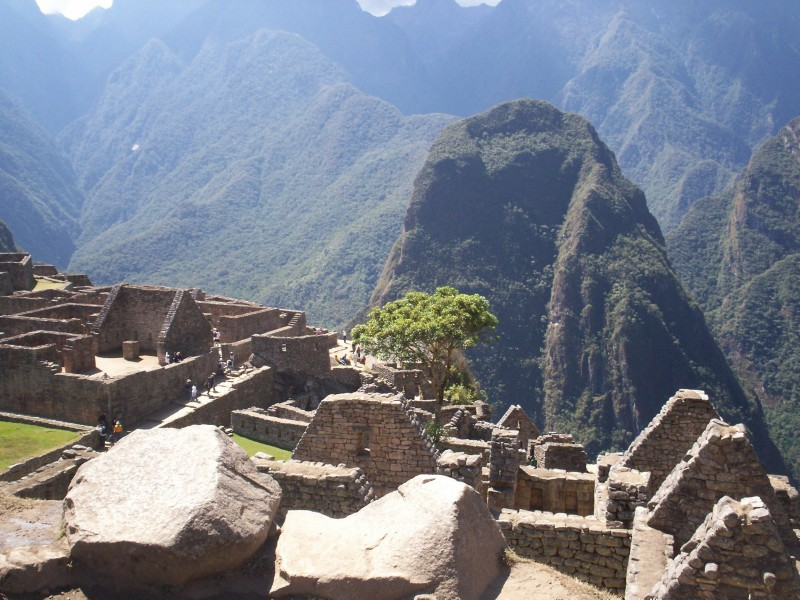

# Landmark_Classification_Project - Convolution Neural Networks
## Project: Write an Algorithm for Landmark Classification

### Introduction

Photo sharing and photo storage services like to have location data for each photo that is uploaded. With the location data, these services can build advanced features, such as automatic suggestion of relevant tags or automatic photo organization, which help provide a compelling user experience. Although a photo's location can often be obtained by looking at the photo's metadata, many photos uploaded to these services will not have location metadata available. This can happen when, for example, the camera capturing the picture does not have GPS or if a photo's metadata is scrubbed due to privacy concerns.

If no location metadata for an image is available, one way to infer the location is to detect and classify a discernible landmark in the image. Given the large number of landmarks across the world and the immense volume of images that are uploaded to photo sharing services, using human judgment to classify these landmarks would not be feasible.

In this project, first steps are taken towards addressing this problem by building a CNN-powered app to automatically predict the location of the image based on any landmarks depicted in the image. An end-to-end machine learning process is implemented: performing data preprocessing, designing and training CNNs, comparing the accuracy of different CNNs, and deploying an app that will accept any user-supplied image as input and suggest the top k most relevant landmarks from 50 possible landmarks from across the world based on the best CNN trained. 

### Scope:
* Design and train a CNN from scratch: cnn_from_scratch.ipynb
* Create transfer learning architecture: transfer_learning.ipynb
* Deploy algorithm in an app: app.ipynb
